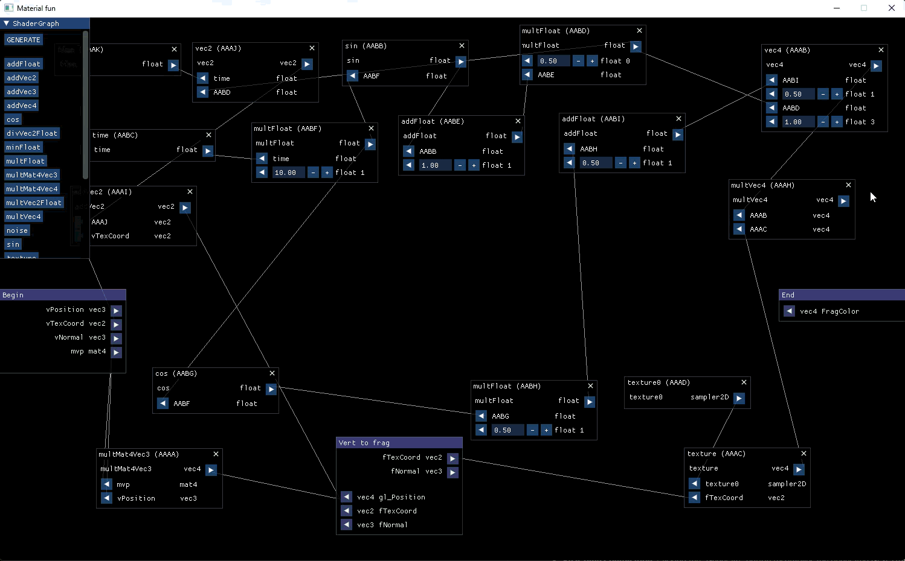

<p align="center">

</p>

# Shader Graph

## Overview
A node-based, visual shader editor built from scratch using C++, OpenGL, and Dear ImGui. Inspired by the material editors found in Unreal Engine and Blender, this application allows users to visually construct shader logic by connecting functional nodes. The graph dynamically generates, compiles, and links valid GLSL vertex and fragment shaders at runtime, applying them in real-time to a 3D model in the viewport.

## Technical Highlights & Architecture
* **Dynamic GLSL Generation:** Node networks are parsed topologically to construct valid GLSL source code on the fly. Mathematical operations, texture sampling, and time variables are automatically translated into properly scoped shader instructions.
* **Real-time Compilation:** Shader graphs are compiled and applied to a 3D midel in the viewport in real-time for instant shader feedback.
* **Custom Node System:** The node-linking architecture uses Dear ImGui. It features visual spline connections, dynamic input fields (floats, vec2, vec3, vec4), and automatic type-checking to prevent invalid node connections.
* **Extensible Function Library:** Shader functions (like noise generation, sine/cosine, and matrix multiplication) are abstracted into a scalable C++ dictionary (`ShaderFunctions.cpp`), making it trivial to add new mathematical nodes to the editor.

### Complex Node Trees
It can handle complex node graphs with inter-shader node connections.
<p align="center">

</p>

## Build Instructions (Windows / MSVC)
This project is configured as a native Visual Studio project. Third-party compiled binaries are excluded from the repository and must be provided locally.

### Prerequisites
You will need the following dependencies:
* [GLFW](https://www.glfw.org/download.html)
* [GLEW](https://glew.sourceforge.net/)
* [GLM](https://github.com/g-truc/glm)
* [GLAD](https://glad.dav1d.de/)
* [stb_image.h](https://github.com/nothings/stb/blob/master/stb_image.h)
* [Dear ImGui](https://github.com/ocornut/imgui) *(Note:  source files are already included directly in the `src/vendor` folder.)*

### Setup & Build
1. Clone the repository:
   ```bash
   git clone https://github.com/mathijs28498/ShaderGraph.git
   ```
2. Create a `libraries` folder in the root directory.
3. Place the downloaded `include` and `bin` folders from your dependencies into the `libraries` folder. The `.vcxproj` expects the following structure:
   * `libraries/include/glfw`
   * `libraries/include/glew`
   * `libraries/include/glm`
   * `libraries/include/glad`
   * `libraries/include/read-image-header` *(Place `stb_image.h` inside this folder)*
   * `libraries/bin/glfw`
   * `libraries/bin/glew`
4. Open the Visual Studio solution/project file in **Visual Studio 2022 or newer**.
5. Set the build configuration to **Release** or **Debug** and platform to **x64**.
6. Build the solution and run.

## Usage
1. Add nodes from the node list onto the graph.
2. Connect output pins (right side) to compatible input pins (left side).
3. Modify exposed float/vector parameters directly on the nodes.
4. Click **GENERATE** on top of the node list to compile the graph and view the result on the 3D model.

## License
This project is licensed under the [MIT License](LICENSE).
